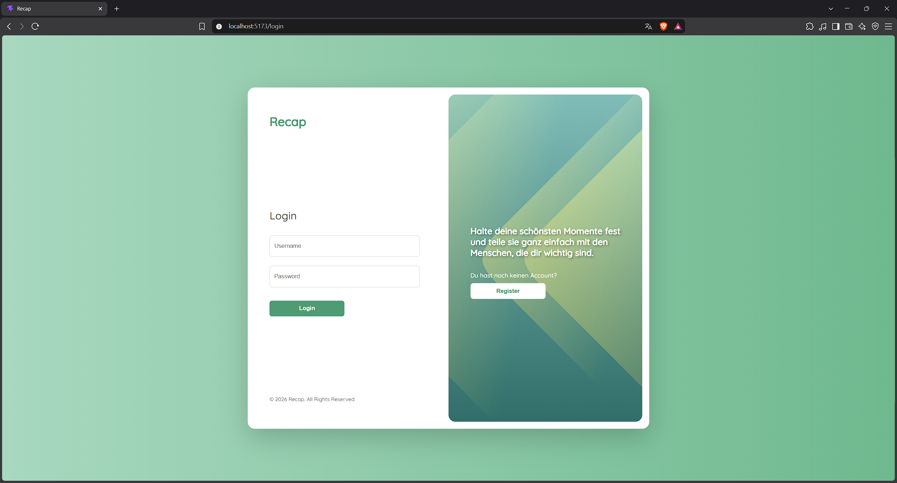
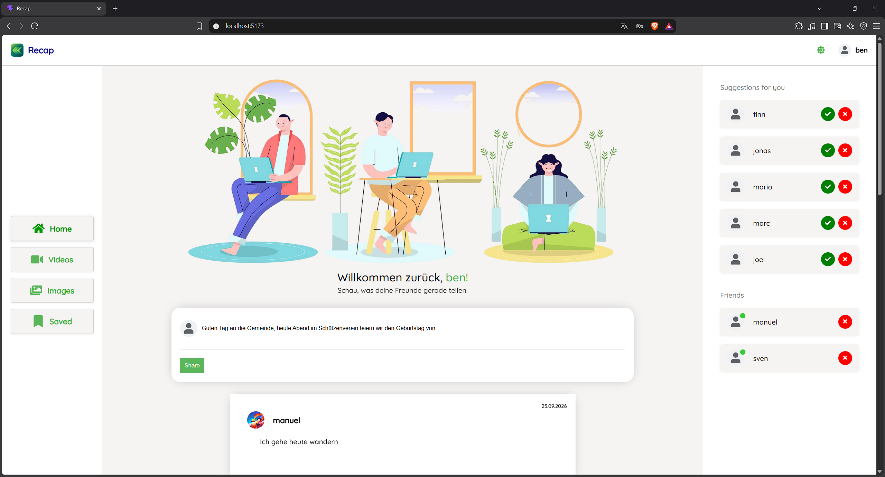
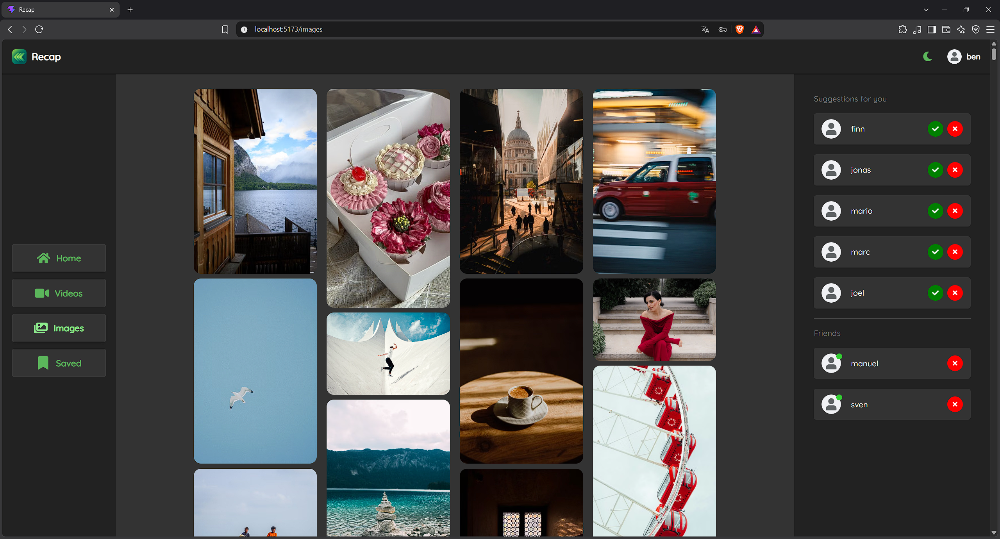
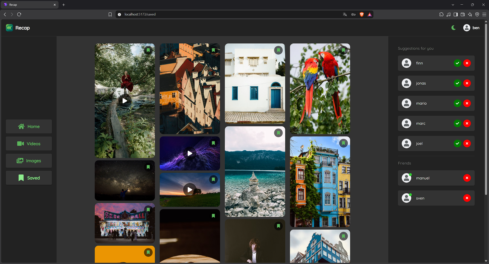

# Recap

## Beschreibung

Eine Social-Media-Web-Anwendung, entwickelt mit React (Vite) im Frontend und Node.js/Express mit MySQL im Backend. Nutzer:innen registrieren sich und melden sich über eine JWT-basierte Authentifizierung an, erstellen Beiträge und folgen anderen. Der Feed zeigt die eigenen Beiträge und die der gefolgten Personen, sortiert nach Datum. Zusätzlich gibt es eine Bilder- und Videogalerie über die Pexels-API, deren Inhalte sich lokal speichern lassen, sowie einen Wechsel zwischen Light- und Dark-Mode.

   

## Features

**Authentifizierung**

- Registrierung mit Username, E-Mail und Passwort (Passwort wird mit bcrypt gehasht)
- Login über JWT, das Token liegt in einem httpOnly-Cookie
- Geschützte Routen: Ohne Login wird automatisch auf die Login-Seite weitergeleitet
- Eingeloggter Zustand bleibt nach einem Neuladen erhalten
  **Feed**
- Beiträge erstellen und direkt im Feed sehen (React Query aktualisiert den Feed nach dem Posten)
- Feed enthält eigene Beiträge und die der gefolgten Personen, neueste zuerst
- Anzeige von Username, Profilbild (mit Standardbild als Fallback) und Datum
  **Follow-System**
- Vorschläge mit allen Nutzer:innen, denen man noch nicht folgt
- Annehmen (folgen) oder Ablehnen (nur aus der Vorschlagsliste entfernen)
- Freundesliste mit der Möglichkeit, wieder zu entfolgen
  **Galerie**
- Bilder: 500 aktuelle Fotos aus Pexels, parallel in 7 Anfragen geladen und lazy gerendert
- Videos: 80 beliebte Videos mit Poster-Bild, Play/Pause per Klick und leichter SD-Qualität
- Bilder und Videos per Lesezeichen speichern, die gespeicherten Inhalte liegen im localStorage
- Eigene Seite „Saved“ mit allen gespeicherten Inhalten
  **Darstellung**
- Light- und Dark-Mode, die Auswahl wird im localStorage gespeichert
- Dreispaltiges Layout mit Navigation links, Inhalt in der Mitte und Vorschlägen/Freunden rechts

## Tech-Stack

**Frontend**

- React 19 mit Vite
- React Router
- TanStack React Query
- Axios
- Material UI (Icons), React Icons
- Sass (SCSS)
- Pexels-API
  **Backend**
- Node.js mit Express 5
- MySQL (`mysql`)
- jsonwebtoken, bcryptjs, cookie-parser, cors
- moment, nodemon

## Installation

Voraussetzungen: Node.js und ein laufender MySQL-Server.

**1. Backend**

```bash
cd api
npm install
npm start
```

Die Zugangsdaten zur Datenbank werden in `db-connect.js` eingetragen. Der Server läuft auf `http://localhost:8800`.

**2. Frontend**

Für die Galerie wird ein kostenloser API-Key von [Pexels](https://www.pexels.com/api/) benötigt. Lege im Ordner `client` eine Datei `.env.local` an:

```
VITE_PEXELS_API_KEY=dein_api_key
```

Danach:

```bash
cd client
npm install
npm run dev
```

Die App ist anschließend unter `http://localhost:5173` erreichbar.
